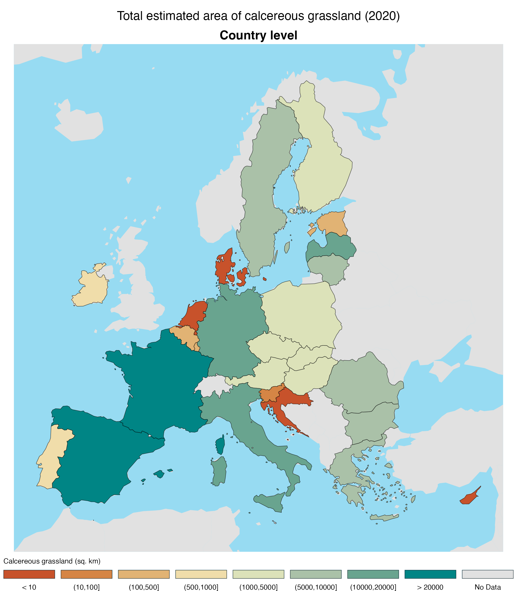
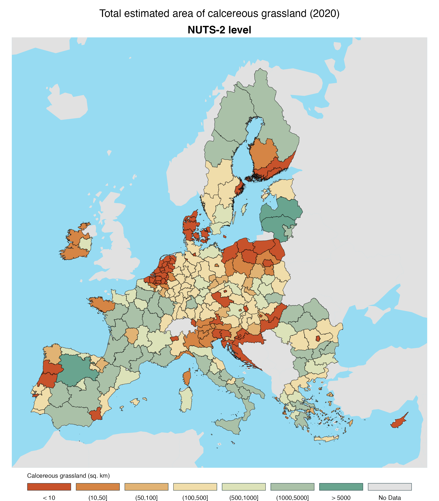

# Calcereous grasslands in Europe

Mapping calcereous grasslands

## Methods

### Data layers

#### Grassland mowing events layer

Provides an estimate of grassland mowing events for the 2020 reference year at 10m resolution for European Union and EEA countries.

Original layer is classified from 0-4 detected mowing events. This was reclassified to `<= 1` and `>1` mowing events.

<https://doi.org/10.2909/114e8cae-1cd7-4adc-8c5f-a04863fc6af9>

#### Livestock layer

***Livestock layer is back***

From the Gridded Livestock of the World database (GLW v4).

Gilbert, Marius; Cinardi, Giuseppina; Da Re, Daniele; Wint, William G. R.; Wisser, Dominik; Robinson, Timothy P., 2022, "Global cattle distribution in 2015 (5 minutes of arc)", <https://doi.org/10.7910/DVN/LHBICE>, Harvard Dataverse, V1

Gilbert, Marius; Cinardi, Giuseppina; Da Re, Daniele; Wint, William G. R.; Wisser, Dominik; Robinson, Timothy P., 2022, "Global goats distribution in 2015 (5 minutes of arc)", <https://doi.org/10.7910/DVN/YYG6ET>, Harvard Dataverse, V1

Gilbert, Marius; Cinardi, Giuseppina; Da Re, Daniele; Wint, William G. R.; Wisser, Dominik; Robinson, Timothy P., 2022, "Global horses distribution in 2015 (5 minutes of arc)", <https://doi.org/10.7910/DVN/JJGCTX>, Harvard Dataverse, V1

Gilbert, Marius; Cinardi, Giuseppina; Da Re, Daniele; Wint, William G. R.; Wisser, Dominik; Robinson, Timothy P., 2022, "Global sheep distribution in 2015 (5 minutes of arc)", <https://doi.org/10.7910/DVN/VZOYHM>, Harvard Dataverse, V1

Livestock units calculation:

```         
ctl <- rast("5_Ct_2015_Da.tif")
shp <- rast("5_Sh_2015_Da.tif")
got <- rast("5_Gt_2015_Da.tif")
hrs <- rast("5_Ho_2015_Da.tif")

lu <- (0.5*ctl) + (0.5*hrs) + (0.125*shp) + (0.125*got)

# convert units to per 1km (originally /10km)
lu.eu <- (lu/100) 
```

#### Calcereous bedrock layer

Hartmann J, Moosdorf N (2012) The new global lithological map database GLiM: A representation of rock properties at the Earth surface. Geochemistry, Geophysics, Geosystems 13:. <https://doi.org/10.1029/2012GC004370>

The high resolution data is available here: <https://www.geo.uni-hamburg.de/en/geologie/forschung/aquatische-geochemie/glim.html>

**Values (Integer data)**

101 = class “sc”, Carbonate Sedimentary Rocks

201 = class “sm”, Mixed Sedimentary Rocks

999 = all other classes

#### Calcereous soil layer

Ballabio, C., Lugato, E., Fernández-Ugalde, O., Orgiazzi, A., Jones, A., Borrelli, P., Montanarella, L. and Panagos, P., 2019. Mapping LUCAS topsoil chemical properties at European scale using Gaussian process regression. Geoderma, 355: 113912.

#### Precipitation layer

Marchi, M., Castellanos-Acuna, D., Hamann, A., Wang, T., Ray, D. Menzel, A. 2020. ClimateEU, scale-free climate normals, historical time series, and future projections for Europe. Scientific Data 7: 428. doi: 10.1038/s41597-020-00763-0

Using Mean Annual Precipitation (MAP) layer 2000s (1991-2020)

<https://sites.ualberta.ca/~ahamann/data/climateeu.html>

#### ~~Impervious layer~~

Areas with impervious cover are **no longer** masked out of the grassland dataset. The new mowing events data should not include impervious areas. 

For reference, past impervious data *was* based on:

European Environment Agency, “Impervious Built-up 2018 (raster 10 m), Europe, 3-yearly, Aug. 2020.” EEA geospatial data catalogue, Aug. 18, 2020. doi: <https://doi.org/10.2909/3e412def-a4e6-4413-98bb-42b571afd15e>.

### Output categories

|   Code | Explanation                                              |
|-------:|:---------------------------------------------------------|
|`90000` | Outside of livestock density mapping area                |
|`30000` | Livestock density is \>25 per km2                        |
|`10000` | Livestock density is 0-25 LU per km2                     |
| `9000` | Outside of lithology mapping area                        |
| `2000` | lithology is not Carbonate/Mixed                         |
| `1000` | lithology is either Carbonate or Mixed Sedimentary rocks |
|  `900` | Outside of CaCO3 mapping area                            |
|  `300` | CaCO3 is == 0                                            |
|  `200` | CaCO3 is \> 200                                          |
|  `100` | CaCO3 is \> 0 and \<= 200                                |
|   `90` | Outside of precipitation mapping area                    |
|   `30` | Annual precipitation is \< 400                           |
|   `20` | Annual precipitation is \> 1000                          |
|   `10` | Annual precipitation is \>= 400 and \<= 1000             |
|    `5` | Outside of grassland mapping area (e.g. water)           |
|    `3` | Non-grassland                                            |
|    `2` | Grassland mowing events \> 1                             |
|    `1` | Grassland mowing events \<= 1                            |

Each layer was coded numerically and resampled to match the grassland reference system and resolution. The operation to combine the layers was:

*Coded output* = *Grassland* + *Precipitation* + *CaCO3* + *Lithology* + *Livestock density*

The coding allowed the conditions in all the input layers to be preserved. There are 576 possible code combinations. The calcereous grassland code is `11111`. Other useful combos:

- `11111` = Meets calcereous grassland definition.
- `11112` = Meets environmental conditions for calcereous grassland but mowed too many times in 2020
- `11131` = Meets calcereous grassland definition, except too dry (1990-2020 average)
- `11121` = Meets calcereous grassland definition, except too wet (1990-2020 average)
- `31111` = Meets calcereous grassland definition, except in a region that has high livestock density

## Results

Table of results by country:

```{r, echo=FALSE, warning=FALSE, message = FALSE}
eu_cg <- read.csv("out/eu_tab.csv") |>
  dplyr::rename(
    `Calcereous grassland [sq. km]` = calc_grass,
    `Non-calcereous grassland [sq. km]`= non_calc_grass,
    `Grassland missing data [sq. km]` = grass_missing_data
  )

knitr::kable(eu_cg |> dplyr::select(NAME_ENGL,`Calcereous grassland [sq. km]`,`Non-calcereous grassland [sq. km]`,`Grassland missing data [sq. km]`) |> dplyr::rename(Country = NAME_ENGL), digits = 0)

```

### EU 27 Country level results



### EU NUTS-2 level results



### Limitations

Border areas differ between layers because of differences in resolution and mapping detail. This could be calculated but generally, grasslands near coastline may be missing because of omission of one or more layers.
